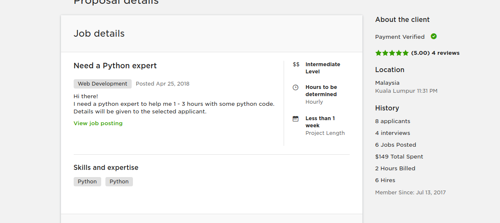
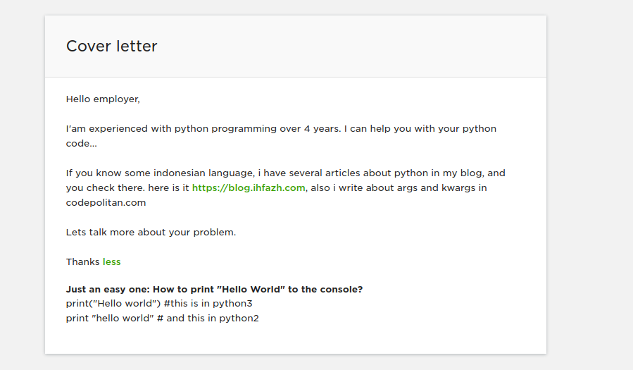
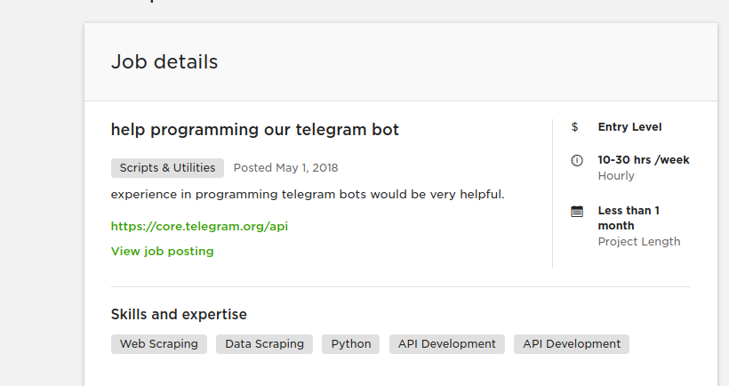
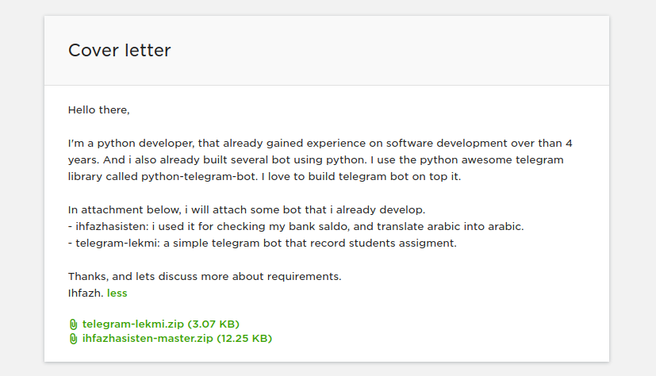

# About Me

@ul
- Muhammad Ihfazhillah
- https://fb.me/mihfazhillah
- https://blog.ihfaz.com
- https://github.com/ihfazhillah
@ulend

---

### Background Pendidikan

Anak Pondokan, suka utak atik kode sejak di pondok.

+++

#### @color[red](Contoh kode yang pernah saya cari)

```
cls
@ECHO OFF
title Folder FolderRahasia
if EXIST "Control Panel.{21EC2020-3AEA-1069-A2DD-08002B30309D}" goto UNLOCK
if NOT EXIST FolderRahasia goto MDLOCKER
:CONFIRM
echo Apakah anda ingin mengunci FolderRahasia tersebut ? (Y/N)
set/p "cho=>"
if %cho%==Y goto LOCK
if %cho%==y goto LOCK
if %cho%==n goto END
if %cho%==N goto END
echo Ketik Y atau N.
goto CONFIRM
:LOCK
ren FolderRahasia "Control Panel.{21EC2020-3AEA-1069-A2DD-08002B30309D}"
attrib +h +s "Control Panel.{21EC2020-3AEA-1069-A2DD-08002B30309D}"
echo FolderRahasia Terkunci
goto End
:UNLOCK
echo Masukkan Password untuk membuka kunci
set/p "pass=>"
if NOT %pass%== masukkanpassword goto FAIL
attrib -h -s "Control Panel.{21EC2020-3AEA-1069-A2DD-08002B30309D}"
ren "Control Panel.{21EC2020-3AEA-1069-A2DD-08002B30309D}" FolderRahasia
echo FolderRahasia sudah di buka
goto End
:FAIL
echo Password salah
goto end
:MDLOCKER
md FolderRahasia
echo FolderRahasia Sukses di buat
goto End
:End
```

sumber : http://blog.akakom.ac.id/rino/cara-mengunci-folder-dengan-notepad/
---

### Bagaimana Belajar

@ul
- Otodidak
- Penasaran yang tinggi
- Luasnya Internet
- Gramedia
- By Project
@ulend

+++ 

#### Project Pertama

repo : https://gitlab.com/ihfazhillah/targeem-desktop


--- 

### Kerja

@ul
- projects.co.id
- dapat email
- lanjut
- daftar kerja (remote)
- upwork
- linkedin
@ulend
 
+++

### Keluar kerja

Pertimbangan keluar kerja di perusahaan:
@ul
- 8 jam + jam mengajar 
- butuh uang lahiran = ngelembur + weekend
- ingin lebih santai
    - memilih par-time (belum dapat projek lagi nih/job)
@ulend

---

### Pythonthusiast & Proposal

@ul
- memutuskan membeli course
- masih kerja (akhir akhir)
- setting feed reader
- apply sebanyak mungkin (yang saya mampu/kemungkinan besar)
@ulend

+++

#### First job



+++


+++

#### Second job

+++



---

### Penutup

@ul
- Semua semata mata Rizq 
- Minta pertolongan kepada Alloh
- Asah kemampuan, banyak baca dan praktek.
- Praktek
- Praktek
- Praktek
@ulend